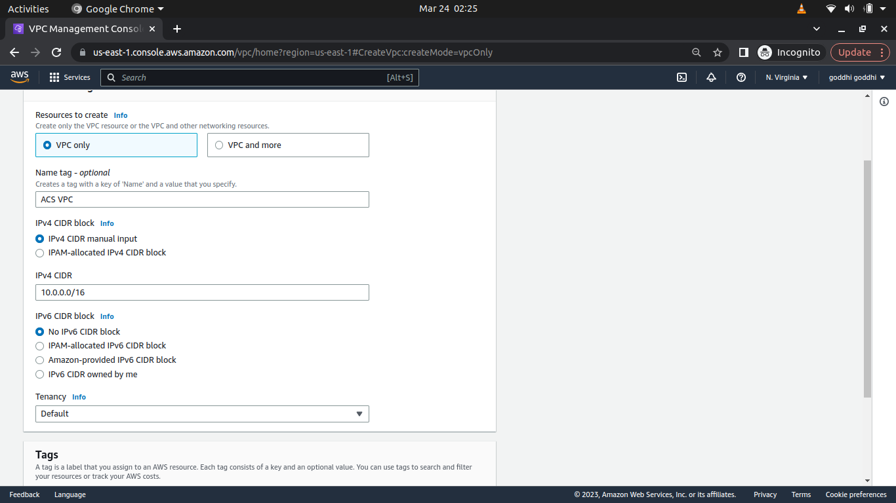
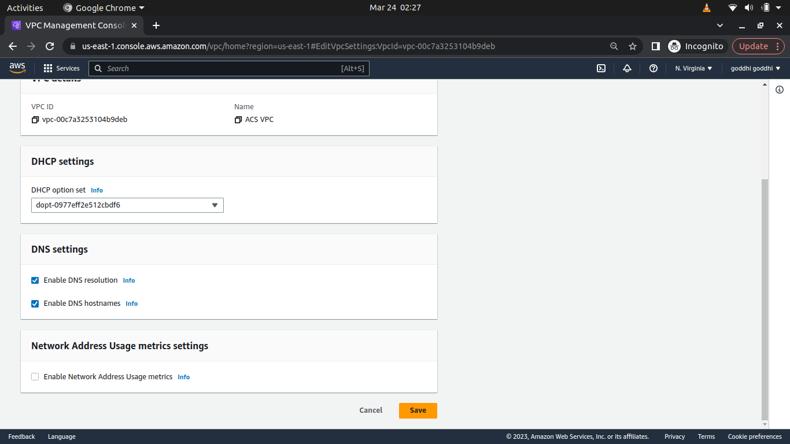
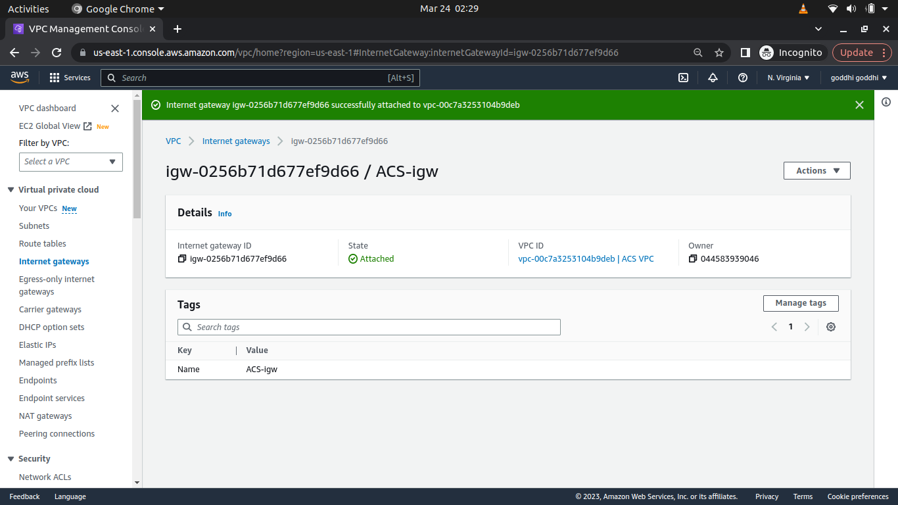
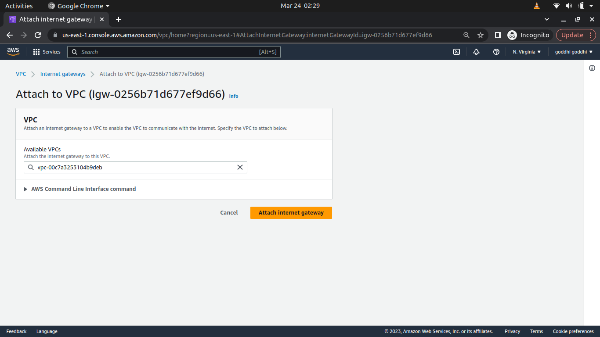
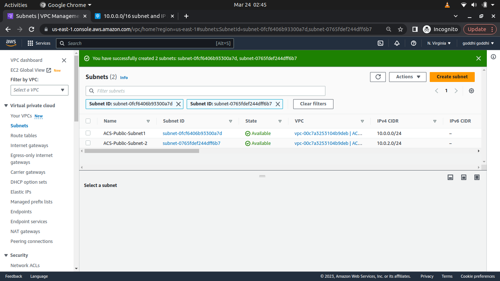
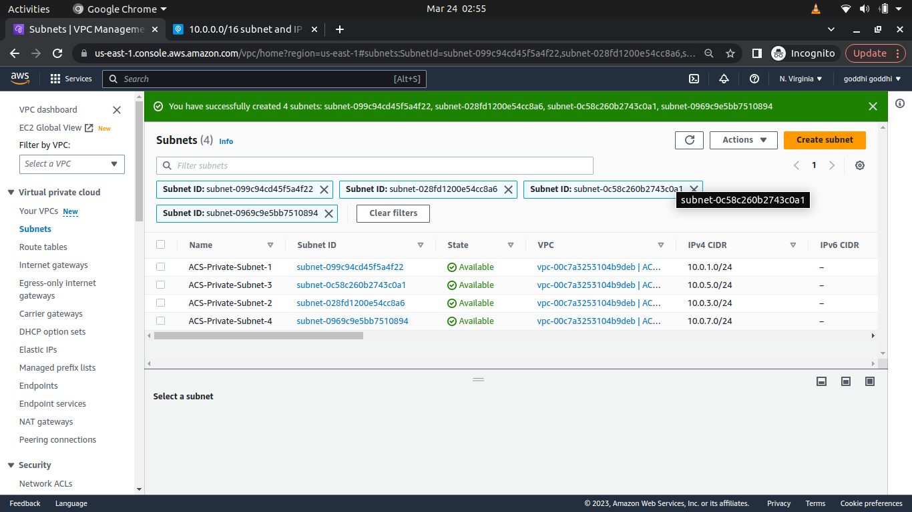
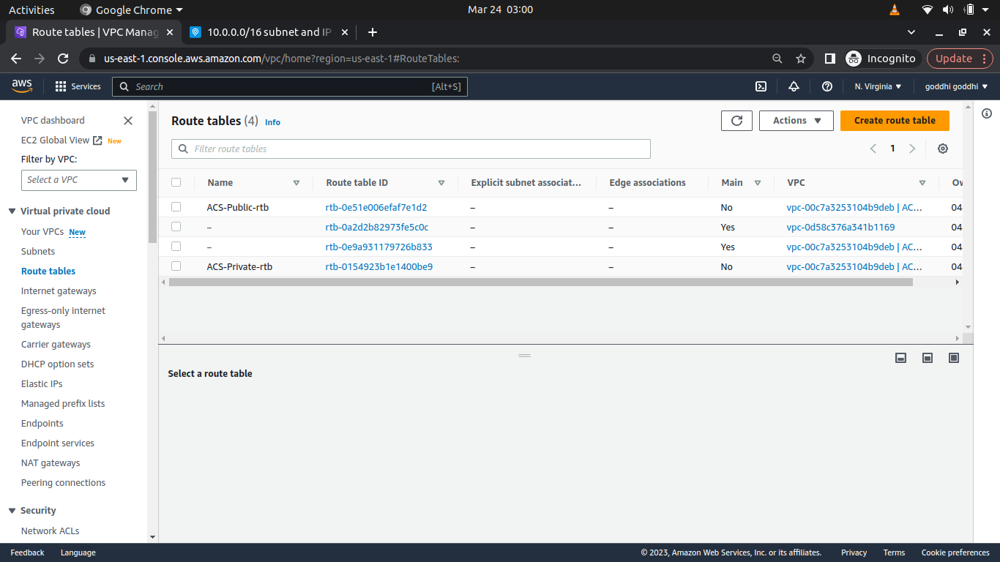
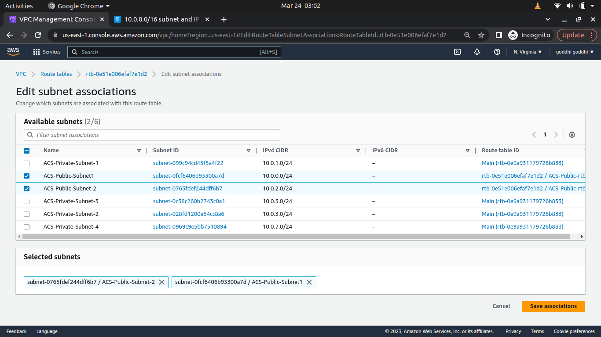
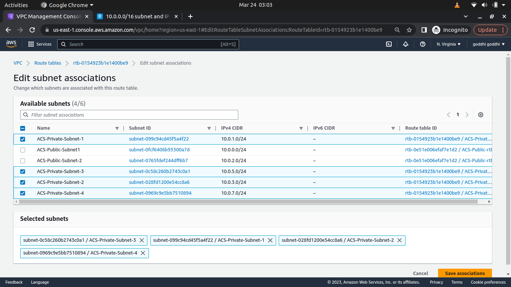
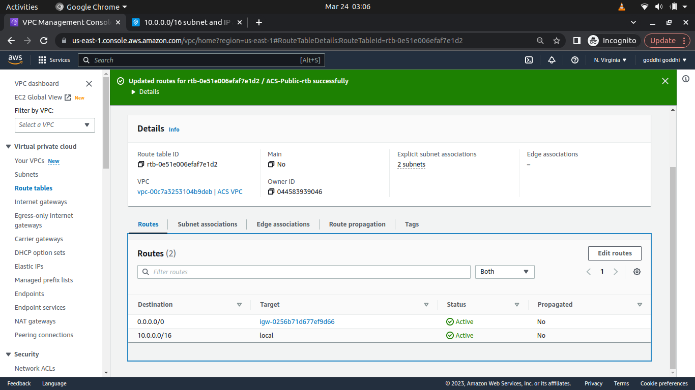

# MANUALLY-IMPLEMENTING-AWS-CLOUD-SOLUTION-FOR-2-COMPANY-WEBSITES-USING-A-REVERSE-PROXY-TECHNOLOG

## Table of Contents

Introduction
Starting Off Your AWS Cloud Project
SET UP A VIRTUAL PRIVATE NETWORK (VPC)
Creating the Subnets
Creating the Route Tables
Creating an Elastic IP
Creating a NAT Gateway
Creating the Security Groups
Assigning Certificate and creating Hosted Zone
Creating the Elastic File System (EFS)
Creating the Relational Database Service (RDS), Key Management Service (KMS) and Subnet Groups
Creating our Resources
Bastion AMI installation
Nginx AMI installation
Webserver AMI installation
Creating our AMI images
Creating our Target groups
Creating our Load Balancers
Creating the Autoscaling Groups
Creating the Route53 records

## Introduction

In this project, you will build a secure infrastructure inside AWS VPC (Virtual Private Cloud) network for a fictitious company (Choose an interesting name for it) that uses WordPress CMS for its main business website, and a Tooling Website for their DevOps team. As part of the company’s desire for improved security and performance, a decision has been made to use a reverse proxy technology from NGINX to achieve this.

## INFRASTRUCTURE ARCHITECTURE DIAGRAM

### Starting Off Your AWS Cloud Project

There are few requirements that must be met before you begin:

1. Properly configure your AWS account and Organization Unit [Watch How To Do This Here](https://youtu.be/9PQYCc_20-Q)

- Create an AWS Master account. (Also known as Root Account).
- Within the Root account, create a sub-account and name it DevOps. (You will need another email address to complete this)

Note: For a newly created account you might need to configure AWS service quota to allow you to create more accounts on the root account. [Read how to do this here](https://aws.amazon.com/premiumsupport/knowledge-center/organizations-account-exceeded/#:~:text=Resolution,Line%20Interface%20(AWS%20CLI).)

- Within the Root account, create an AWS Organization Unit (OU). Name it Dev. (We will launch Dev resources in there)

- Move the DevOps account into the Dev OU.
- Login to the newly created AWS account using the new email address.

2. Create a free domain name for your fictitious company at Freenom domain registrar [here](https://www.freenom.com/).

Create a hosted zone in AWS, and map it to your free domain from Freenom. This gives a guide on how to do this

3. Create a hosted zone in AWS, and map it to your free domain from Freenom. [This gives a guide on how to do this](https://youtu.be/IjcHp94Hq8A)

### SET UP A VIRTUAL PRIVATE NETWORK (VPC)

A VPC is a virtual network that you can define within AWS. It is logically isolated from other virtual networks in the AWS Cloud. You can launch your AWS resources, such as Amazon EC2 instances, into your VPC. You can specify an IP address range for the VPC, add subnets, associate security groups, and configure route tables. You can also create an Internet gateway and attach it to your VPC so that instances have access to the Internet. For more information, see [Amazon VPC User Guide](https://docs.aws.amazon.com/vpc/latest/userguide/what-is-amazon-vpc.html).

We would be using the architecture diagram above for this project.

- Create a VPC

output: 

We need to ensure that dns hostnames are enabled for our VPC. This is to ensure that our EC2 instances can resolve each other using their private IP addresses. To do this, go to the VPC dashboard, select your VPC, and click on the Actions button. Select Edit DNS Hostnames and enable it.

- Create an internet gateway and attach it to the created vpc.

- Then attach the internet gateway to the VPC.

### Creating the Subnets

- The next thing is to create the subnets. We would use ipinfo to get the IP address ranges for the different regions. You can decide how you intend to assign the IP address ranges to the subnets. Here I would be using even-number addresses for public subnets and odd-number IP addresses for private subnets. We would use the IP address ranges for the different regions to create the subnets. We would create 6 subnets for the VPC. Two public subnets and four private subnets The subnets would be in the us-east-1 availability zone. As we would be using us-east-1a and us-east-1b.

Public subnet 1 and Public subnet 2 

Private subnets 1 2 3 4

### Creating the Route Tables

- We then move on to creating the route tables. Here, we would be creating two route tables. A public and private route table.

Public and Private rtb

- Now we associate the route tables with their corresponding subnets. Navigate to the subnet associations after selecting the route table and click on edit associations. Select the subnets you want to associate with the route table and click save.

Associate public route table with public subnets

Associate private route table with private subnets

- Now we need to edit the routes of the route tables.

  - For the public route table, we would add a route to the internet gateway. This is to allow the public subnets to have access to the internet. To do this, click on the route table, select routes, and click on edit routes. Add a new route with the destination as '0.0.0.0/0' and the target as the internet gateway, this would bring up the internet gateway drop down. Select the internet gateway you created earlier and click save.

